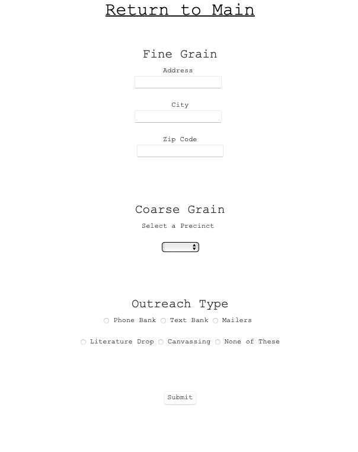
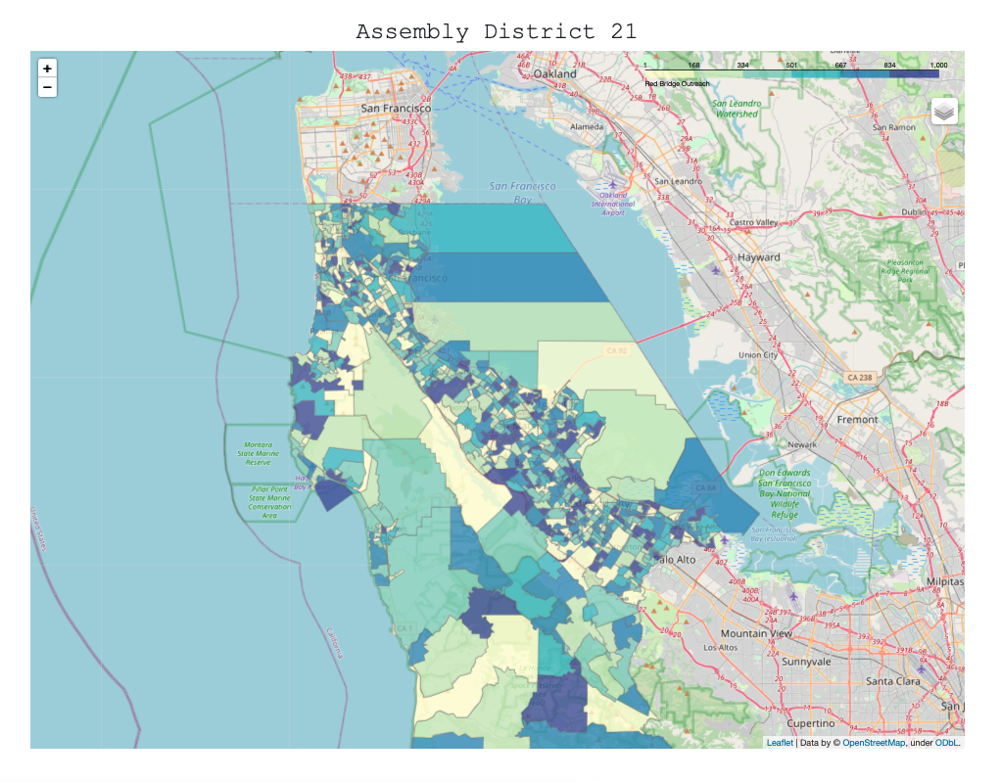

# mapping-assembly-district-21

This is a full-stack web application developed to track voter outreach in Assembly District 21 prior to election day (November 2022).

## Usage Notes

This app is designed to be user friendly! The end user can input either an exact address (`Fine Grain`) or select a precinct broadly (`Coarse Grain`), along with the type of outreach conducted (e.g., phone banking, text banking, canvassing, etc.)

 

The user's selections are pushed to a `SQLite` database, where **counts per precinct** are aggregated and mapped.

